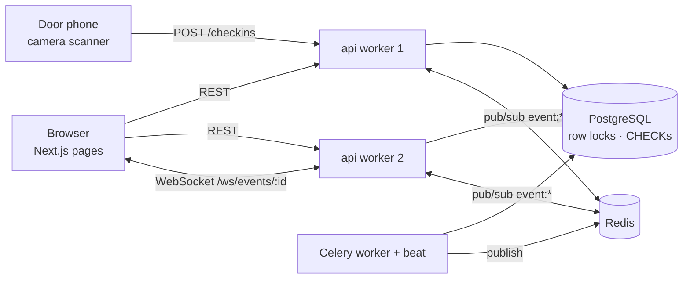

# QueueUp

**Event ticketing and door check-in that never sells the same seat twice, even when 100 people hit "reserve" on the last ticket in the same millisecond.**

Organizers create events with capacity-limited ticket tiers. Attendees reserve a seat, pay within a 10-minute hold, and get a signed QR code. Door staff scan it from a phone browser. Seat counts and check-ins update live over WebSockets.

`Next.js + TypeScript` · `FastAPI` · `PostgreSQL` · `Redis` · `Celery` · `Docker Compose` · `GitHub Actions`

**Live demo: [web-production-4cbcf.up.railway.app](https://web-production-4cbcf.up.railway.app/)** · [API docs](https://queueup-production-c3bd.up.railway.app/docs)

To look around as an organizer or door staff, log in as `organizer@demo.queueup.app` or `staff1@demo.queueup.app` with password `queueup-demo`. The site is filled with clearly labeled demo events, and payments use simulated test cards (pick "Visa 4242" at checkout). Or sign up and buy a ticket yourself.

---

## The hard part: no overselling

Here's the naive version, with capacity 50 and 49 seats already sold:

```
A: SELECT count(*) …  -> 49
B: SELECT count(*) …  -> 49        (A hasn't inserted yet)
A: 49 < 50 ? yes -> INSERT          (50)
B: 49 < 50 ? yes -> INSERT          (51)  <-- OVERSOLD
```

QueueUp makes the check and the write one step that can't be interrupted:

```sql
BEGIN;
SELECT capacity, sold FROM ticket_types WHERE id = :id FOR UPDATE;  -- B waits here until A commits
-- release any holds on this type whose deadline passed (see "holds" below)
-- if capacity - sold < quantity: ROLLBACK -> 409 sold_out
INSERT INTO orders …; INSERT INTO tickets …;
UPDATE ticket_types SET sold = sold + :quantity WHERE id = :id;
COMMIT;
```

The database also enforces it with `CONSTRAINT ticket_types_sold_le_capacity CHECK (sold <= capacity)`. If a code path ever skipped the lock, Postgres would still reject the oversell.

Every other race uses the same move: **a guarded `UPDATE … WHERE <expected state> RETURNING`, where "zero rows affected" means you lost.**

| Race | Guard | Loser gets |
|---|---|---|
| Two buyers, one seat | `SELECT … FOR UPDATE` on the ticket type | `409 sold_out` |
| Pay at the instant the hold expires | `WHERE status='pending' AND expires_at > now()` vs. the sweeper's `expires_at <= now()` | `410 hold_expired` (payment voided) |
| Same QR at two doors | `WHERE status='confirmed'` | `409 already_used`, with who scanned it and when |
| Double-clicked "reserve" | `orders.idempotency_key UNIQUE` | `409 duplicate_request` + the original `order_id` |
| Refund racing a door scan | refund requires every ticket still `confirmed` | `409 already_checked_in` |
| Organizer lowers capacity mid-sale | same row lock as reserve, `new_capacity >= sold` | `409 capacity_below_sold` |
| A seat frees while people wait | promotion runs inside the same row lock, strictly first in line first | walk-up buyer gets `409 sold_out` with `waitlist: true` |

**One lock order prevents deadlocks.** Every writer that touches more than one table takes locks in the order `ticket_types → orders → tickets`. Confirm and check-in never lock a ticket type. Because no two writers ever wait on each other in a cycle, there are no deadlocks.

**One clock.** Every expiry check compares against Postgres `now()`, never against the app server's or the browser's clock. The checkout countdown is cosmetic. It uses the `server_now` field in the response to correct for skew in the browser's clock.

### The proof

[`api/tests/test_concurrency.py`](api/tests/test_concurrency.py) runs against real Postgres:

- **100 buyers race for 1 seat**: exactly 1 gets `201` and 99 get `409`. `sold = 1`, and there is 1 active ticket row.
- **50 buyers each want 3 of 10 seats**: exactly 3 orders succeed and nobody gets a partial order.
- **Capacity is cut while 40 buyers race**: `sold` never ends up above `capacity`.
- **The naive read-then-write oversells.** This test keeps the bug reproducible.
- **The CHECK constraint fires** when someone tries to write `sold > capacity` directly.

Other suites cover the confirm-vs-sweeper race (25 orders at once), 20 simultaneous scans of one QR (exactly 1 admitted, all 20 logged), a storm of 10 double-clicks with the same idempotency key (1 order), and the rest of the edge cases.

```
$ pytest -v tests/test_concurrency.py
tests/test_concurrency.py::test_100_buyers_race_for_the_last_seat_exactly_one_wins PASSED                                    [ 20%]
tests/test_concurrency.py::test_multi_ticket_orders_are_all_or_nothing_under_contention PASSED                               [ 40%]
tests/test_concurrency.py::test_concurrent_capacity_cut_and_sales_never_go_negative PASSED                                   [ 60%]
tests/test_concurrency.py::test_naive_read_then_write_oversells PASSED                                                       [ 80%]
tests/test_concurrency.py::test_check_constraint_is_the_last_line_of_defense PASSED                                          [100%]

5 passed in 11.77s

$ pytest
64 passed
```

---

## Architecture



- **web**: Next.js App Router. The landing page shows live platform totals on a ballpark scoreboard, and `/about` explains and replays the 100-buyer race. Its visual system is documented in [DESIGN.md](DESIGN.md) and the product context in [PRODUCT.md](PRODUCT.md). The public event pages are server-rendered. Checkout, tickets, the organizer console and the scanner are client pages.
- **api**: FastAPI with async SQLAlchemy/asyncpg. Compose runs 2 uvicorn workers so the real-time path is exercised across processes.
- **worker**: Celery with beat. It sweeps expired holds every 15s, closes past events, sends reminder emails 24h ahead, and runs an hourly inventory reconcile.
- **postgres**: the source of truth. The schema is in [`api/alembic/versions/0001_initial.py`](api/alembic/versions/0001_initial.py).
- **redis**: carries WebSocket fan-out between workers and holds the rate-limit counters.

### Holds

Reserving inserts tickets as `held` with `expires_at = now() + 10 min`. If nobody pays, the seat returns to inventory in one of two ways:

1. **The sweeper** (every 15s) expires due holds in a short transaction per ticket type, under the same lock as reserve.
2. **Reserve itself** first expires any due holds on the type it just locked. So a hold that expired 3 seconds ago never makes the event look sold out while the sweeper hasn't caught up.

Both paths run the same function, `expire_due_holds`. Every job can safely run twice: the sweeper's guard skips rows that are already expired, and reminders are claimed with `UPDATE … WHERE reminder_sent_at IS NULL` before the email is sent.

### Waitlist

When a ticket type sells out, people can join its waitlist for 1 to 4 seats. Whenever a seat frees up (an unpaid hold expires, someone releases or refunds, or the organizer adds capacity), the person at the front of the line automatically gets an ordinary hold with 15 minutes to pay. If they don't, it passes to the next person.

- **Strictly first come, first served.** A freed seat goes to the line before any walk-up buyer, and nobody skips ahead: if the front person wants 2 seats and only 1 is free, everyone waits.
- **Same guarantee as buying.** Promotion happens inside the ticket type's row lock, next to everything else that moves seats, so a freed seat can never be handed to two people. A test has 30 people join at once, then two sweepers and a walk-up buyer race for one freed seat: exactly one person ends up holding it, and it's whoever joined first.
- **Freed seats stick.** Before serving a buyer, overdue holds are settled onto the waitlist in their own committed transaction, so the seats stay with the people in line even when the buyer's own request then fails.
- **Self-healing.** The background sweeper also revisits any ticket type with people waiting and seats free, so a missed promotion is corrected within one sweep.

### Real-time

Handlers publish to the Redis channel `event:<id>` **after the transaction commits**, so a seat change that rolled back is never broadcast. Each API worker runs one pattern subscriber that forwards messages to its own sockets. Seat counts go to everyone. Check-in and order messages go only to sockets authenticated as the organizer or assigned staff. If Redis is down, messages are still delivered to sockets on the same worker and HTTP keeps working.

Live counts are for display only. Whether a sale succeeds is decided by the locked transaction, never by the number in a WebSocket message.

### QR codes

A QR holds an HMAC-signed token over `{ticket_id, event_id}`, never a bare id. It uses its own secret, separate from the session JWT secret.

- **Forgery** is stopped by the signature.
- **Wrong door** is stopped because the token carries `event_id`.
- **A shared screenshot** is still only one ticket. The `confirmed → checked_in` guard makes the second scan return "already used".

Every scan attempt, including forged codes, is recorded in `check_in_events` for audit.

### Auth and roles

| Role | Can do | How you get it |
|---|---|---|
| **User** | Browse, buy tickets, scan doors at events they're assigned to | Signing up |
| **Organizer** | Everything a user can, plus create and run their own events and assign door staff | Request it in the app; the admin approves |
| **Admin** | Everything: every event and user, approve organizers, suspend accounts | Your email is listed in the server's `ADMIN_EMAILS` setting |

Admin is never stored in the database and can't be granted through the API: the stored role column only allows `user` or `organizer`, enforced by a CHECK constraint. So no admin-panel bug or crafted request can create an admin, and removing an email from `ADMIN_EMAILS` revokes admin on the next request. Door staff stays per-event: an organizer assigns any account by email.

Roles and per-event access are looked up on every request, never baked into the token, so approving an organizer or removing a staffer takes effect immediately with no re-login. A demoted organizer keeps the events they already own but can't create new ones.

Passwords are hashed with argon2id. Access JWTs last 15 minutes, with 7-day refresh tokens. Login returns the same error and takes the same time whether or not the email exists. Signup, login (per IP and per account), reservations, organizer requests and scans are rate-limited in Redis. If Redis is unavailable the limiter lets requests through; inventory safety never depends on it.

---

## Run it

```bash
cp .env.example .env
docker compose up --build
```

- App: http://localhost:3000 (landing page; events are at `/events`)
- API docs (OpenAPI): http://localhost:8000/docs
- Health check: http://localhost:8000/health

Postgres and Redis are exposed on host ports **5433** and **6380** so they don't clash with local installs.

**Load demo data.** This fills the app with a realistic, clearly labeled dataset in a few seconds:

```bash
docker compose exec api python -m app.seed --reset
```

It creates 24 events across eight cities and time zones in every state: on sale, nearly full, sold out, live checkout holds, past events with door check-ins and rejected scans, a cancelled event with refunds, and drafts. Around them come six organizers, eight door staff and 300 attendees (`--attendees N` for more), with about 1,350 orders and 2,350 tickets. Every demo account is on `@demo.queueup.app`. The API flags those events `is_demo` and the site labels them "Demo event". `--reset` deletes only demo accounts and their data.

Log in as `organizer@demo.queueup.app` (organizer dashboards), `staff1@demo.queueup.app` (door scanner) or any seeded attendee. The password for every demo account is `queueup-demo`.

**Demo in two minutes:**

1. Sign up and go to **Organize → New event**. Make 2 seats, then **Publish**.
2. Open the event in two browser windows logged in as two different users.
3. Reserve in one window and watch "2 left" drop to "1 left" in the other.
4. Pay with the test card, then open **My tickets** to see the QR.
5. Assign a staffer by email and open **Door scanner** on a phone. Scan the QR twice: the first scan is green, the second is amber "already checked in".
6. Watch the organizer dashboard count climb live.

To watch a hold expire on its own, run `HOLD_SECONDS=45 docker compose up`.

**End-to-end smoke test** (against the running stack):

```bash
pip install httpx websockets
HOLD_SECONDS=45 docker compose up -d --build
python scripts/smoke.py
```

It races two buyers, waits for the worker to expire the winner's hold, checks that the WebSocket received the released seat, resells it, double-scans the ticket, and verifies the dashboard, the CSV and the server-rendered pages.

**Backend tests** (need Postgres; compose provides it):

```bash
cd api
python -m venv .venv && .venv/bin/pip install -r requirements-dev.txt   # Windows: .venv\Scripts\
docker compose up -d postgres redis
.venv/bin/pytest -v
```

> The camera needs a secure context, so the scanner works on `localhost` or over HTTPS. When testing from a phone on your LAN, use a tunnel (e.g. `cloudflared`, `ngrok`) or the paste-a-code box.

---

## API

| Method & path | Who | Purpose |
|---|---|---|
| `POST /auth/signup` · `/auth/login` · `/auth/refresh` | public | Get JWT access + refresh tokens |
| `GET /events` | public | Published events, cursor-paginated |
| `GET /events/{id}` | public (drafts: owner) | Detail, tiers, seats remaining |
| `POST /events` · `PATCH /events/{id}` · `DELETE /events/{id}` | owner | Create draft, edit, publish, cancel, or delete (only with no orders) |
| `POST/PATCH/DELETE /events/{id}/ticket-types[/{tid}]` | owner | Tiers; capacity edits go through the locked path |
| `GET/POST/DELETE /events/{id}/staff` | owner | Assign door staff by email |
| `GET /events/{id}/dashboard` | owner, staff | Held, paid, checked-in, revenue, recent scans |
| `GET /events/{id}/attendees.csv` | owner | Export, protected against formula injection |
| `POST /events/{id}/reservations` | user | Reserve N seats as a hold (needs `idempotency_key`) |
| `GET /orders/{id}` · `POST /orders/{id}/confirm` · `DELETE /orders/{id}` · `POST /orders/{id}/refund` | order owner | Checkout, release, refund |
| `GET /me/tickets` · `/me/holds` · `/me/events` · `/me/staff-events` | user | Personal views |
| `POST /checkins` | owner, staff | Scan `{qr, event_id}` and get a verdict |
| `POST /events/{id}/waitlist` · `DELETE /waitlist/{id}` · `GET /me/waitlist` | user | Join a sold-out ticket type's line (only when it's sold out), leave it, see your place and any seat held for you |
| `WS /ws/events/{id}?token=` | public / staff | Live seats; check-ins for staff |
| `POST/DELETE /me/organizer-request` | user | Ask for (or withdraw a request for) organizer access |
| `GET /admin/stats` · `GET /admin/users` · `GET /admin/events` | admin | Platform totals, searchable users (with the request queue), and every event in every state |
| `PATCH /admin/users/{id}` | admin | Approve or decline organizer requests, change role (user or organizer only), suspend or restore |
| `POST /admin/events/{id}/suspend` | admin | Cancel any event (refunds paid orders) |

Status codes: `409` means the world changed under you (a lost race or an already-used ticket). `410` means the hold expired. `422` means bad input or an invalid QR. `403` means a role or scoping failure. `401` means a missing or expired token.

---

## Edge cases handled

Two buyers for one seat · confirming as the hold expires · the same QR at two doors · double-submit · capacity cut below sold (rejected) · deleting an event that has orders (blocked; cancel instead, which refunds) · an expired hold the sweeper hasn't reached yet · app-server clock skew (DB clock only) · venue time zones (stored in UTC plus an IANA zone, shown in venue time) · all-or-nothing multi-ticket orders · refund after check-in (blocked) · zero or negative values (CHECK constraints plus validation) · reserving for draft, cancelled or ended events · scanning an unpaid hold · a scan for the wrong event · forged QRs · payment authorized but the hold lost (voided) · stale counts on other workers (Redis pub/sub) · open redirects via `?next=` · CSV formula injection.

## Deliberately out of scope (v1)

Real card settlement (payments are simulated with the authorize → capture/void shape of a real provider), assigned-seat maps, offline scanning, and Redis `DECR` as an inventory gate for flash sales. Row locks are plenty at this scale, and Redis would become a second source of truth.

## Deploying

Any host with Postgres, Redis and a worker process works (Render, Fly.io, Railway, AWS). Set `ENVIRONMENT=production`, `SECRET_KEY` and `QR_SECRET` (random, 32+ bytes; the API refuses to boot otherwise), `DATABASE_URL`, `REDIS_URL`, `CORS_ORIGINS` and `ADMIN_EMAILS`. Emails aren't verified, so **create your own account first**, then add its address to `ADMIN_EMAILS` on both the api and worker services. Once your account exists, nobody else can register that address. Build the web image with `NEXT_PUBLIC_API_URL` set to the public API URL. The API image runs `alembic upgrade head` on start.
